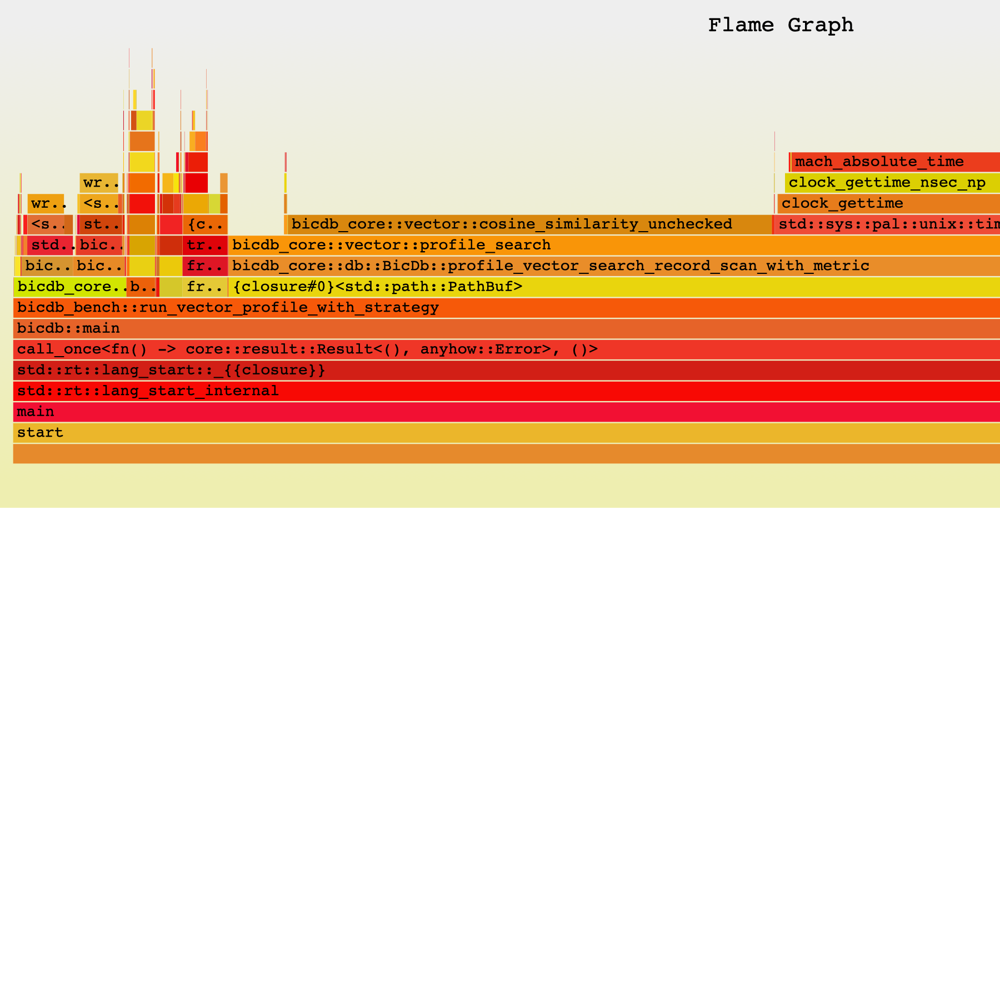
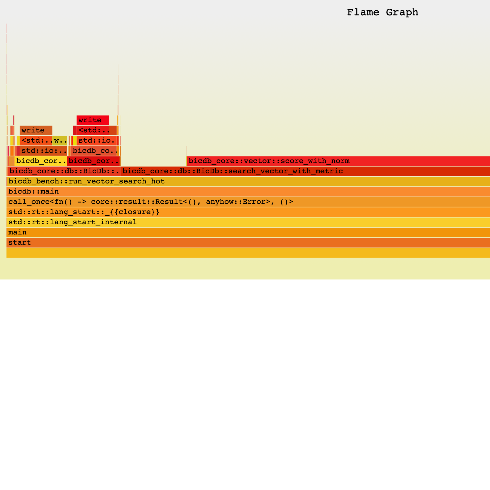

# BicDB Vector Search Profile

Date: 2026-06-20

Build: `cargo run --release -p bicdb-cli`

Workload: exact cosine search, `dim=64`, `top_k=10`, synthetic vectors generated by the benchmark harness.

## Summary

The optimized path keeps vectors in contiguous memory, precomputes vector norms, uses the SIMD dot path for cosine scoring, and keeps bounded top-k heap selection. Filtered searches still use the legacy record scan so the change stays scoped.

| Records | Before strategy | After strategy | Profile p50 before | Profile p50 after | Speedup | Search allocations before | Search allocations after | Allocated bytes before | Allocated bytes after | DB size |
| ---: | --- | --- | ---: | ---: | ---: | ---: | ---: | ---: | ---: | ---: |
| 10,000 | `record_scan` | `optimized_store` | 0.519 ms | 0.415 ms | 1.25x | 361 | 54 | 66,776 | 12,838 | 7.12 MiB |
| 100,000 | `record_scan` | `optimized_store` | 15.013 ms | 4.050 ms | 3.71x | 406 | 54 | 75,033 | 12,838 | 71.53 MiB |
| 1,000,000 | `record_scan` | `optimized_store` | 166.348 ms | 75.949 ms | 2.19x | 346 | 54 | 64,196 | 12,838 | 718.12 MiB |

The profile p50 numbers are from the phase profiler. It isolates read, similarity, heap, and final-sort timings, so it is useful for bottleneck attribution but includes profiling overhead. The raw search hot-loop flamegraph run at 100k vectors measured p50 `3.244 ms` for `record_scan` and p50 `0.436 ms` for `optimized_store` under the macOS Time Profiler run.

## Phase Breakdown

| Records | Read before | Read after | Similarity before | Similarity after | Top-k heap before | Top-k heap after | Final sort before | Final sort after |
| ---: | ---: | ---: | ---: | ---: | ---: | ---: | ---: | ---: |
| 10,000 | 0.037 ms | 0.005 ms | 0.153 ms | 0.057 ms | 0.171 ms | 0.155 ms | 0.000084 ms | 0.000792 ms |
| 100,000 | 0.644 ms | 0.038 ms | 5.702 ms | 0.449 ms | 1.621 ms | 1.524 ms | 0.000986 ms | 0.000361 ms |
| 1,000,000 | 4.853 ms | 0.230 ms | 67.342 ms | 39.888 ms | 15.367 ms | 15.158 ms | 0.000750 ms | 0.001458 ms |

## Flamegraphs

Before, raw record-scan search hot loop:



After, raw optimized-store search hot loop:



SVG sources are also checked in:

- `before-flamegraph.svg`
- `after-flamegraph.svg`

## Commands

Phase profiles:

```bash
cargo run --release -p bicdb-cli -- bench vector-profile \
  --records 100000 --dim 64 --top-k 10 --searches 3 \
  --metric cosine --strategy record-scan \
  --json-out reports/vector-search-profile/before-100k.json \
  --csv-out reports/vector-search-profile/before-100k.csv

cargo run --release -p bicdb-cli -- bench vector-profile \
  --records 100000 --dim 64 --top-k 10 --searches 3 \
  --metric cosine --strategy optimized-store \
  --json-out reports/vector-search-profile/after-100k.json \
  --csv-out reports/vector-search-profile/after-100k.csv
```

Search hot-loop flamegraphs:

```bash
cargo flamegraph -p bicdb-cli --bin bicdb \
  --output reports/vector-search-profile/before-flamegraph.svg -- \
  bench vector-search-hot --records 100000 --dim 64 --top-k 10 \
  --searches 2000 --metric cosine --strategy record-scan

cargo flamegraph -p bicdb-cli --bin bicdb \
  --output reports/vector-search-profile/after-flamegraph.svg -- \
  bench vector-search-hot --records 100000 --dim 64 --top-k 10 \
  --searches 10000 --metric cosine --strategy optimized-store
```

## Recommendations

1. Keep the optimized exact scan as the v0.1 default for unfiltered vector search.
2. Add a filtered contiguous path by translating JSON filters into candidate index lists or bitsets, then score only matching vector indices.
3. Store inverse norms, not only norms, to replace the cosine division with multiplication.
4. Replace the binary heap with a fixed-size top-k array for very small `k` values such as 10; heap timing is now a visible cost once similarity gets faster.
5. Persist a vector sidecar segment so startup can mmap contiguous vectors directly instead of rebuilding the in-memory store from record JSON.
6. Add multi-threaded shard scanning for 1M+ vectors after the single-threaded exact path is stable.
7. Consider an ANN index only after the exact contiguous scan stops meeting latency targets.
